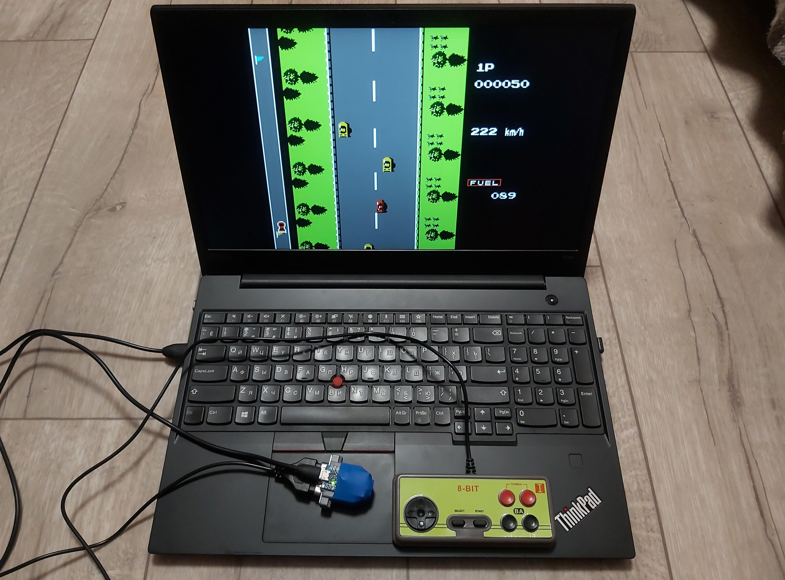
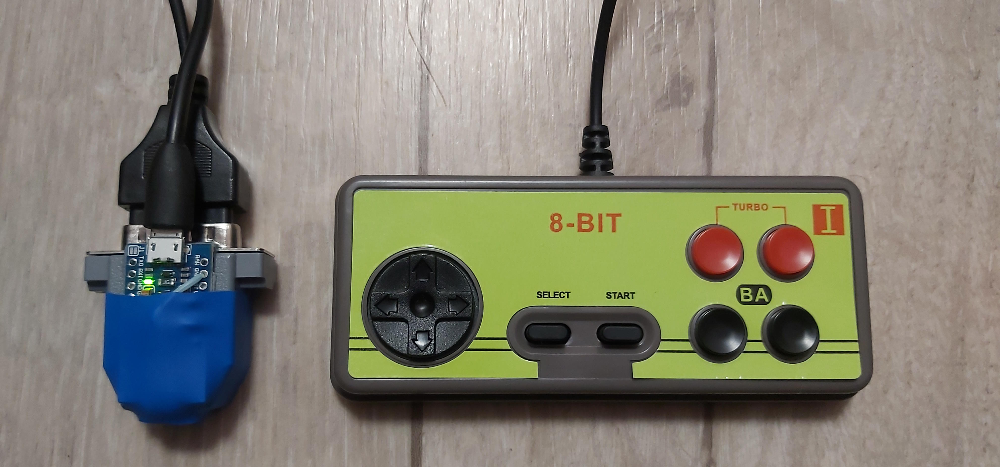
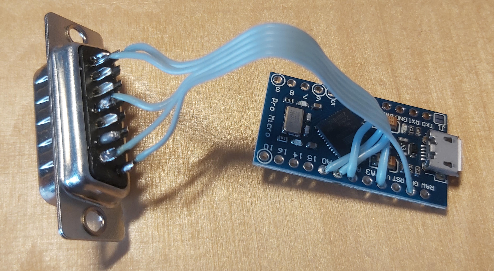
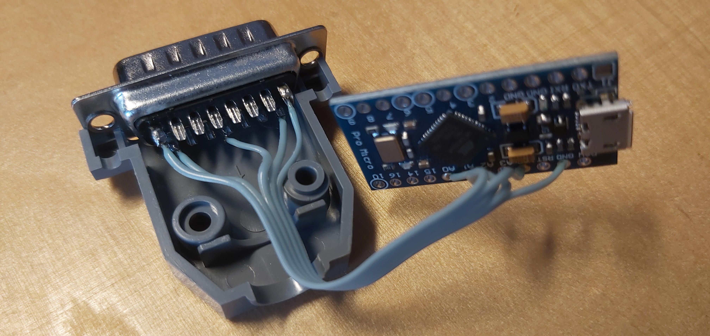
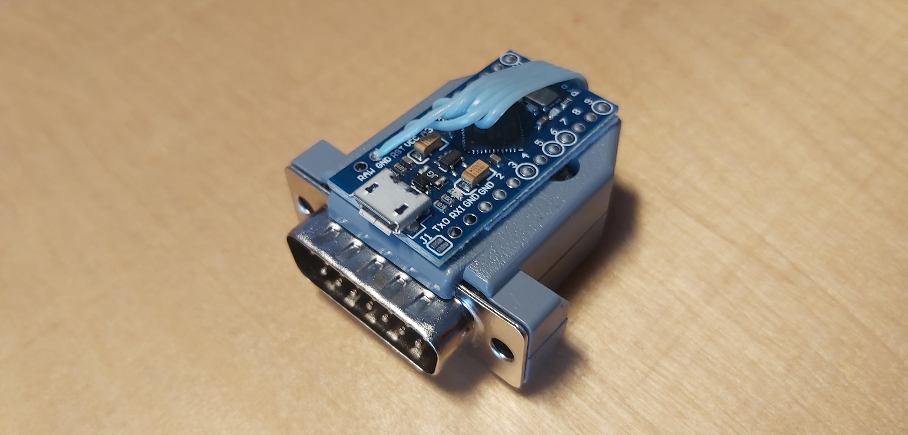
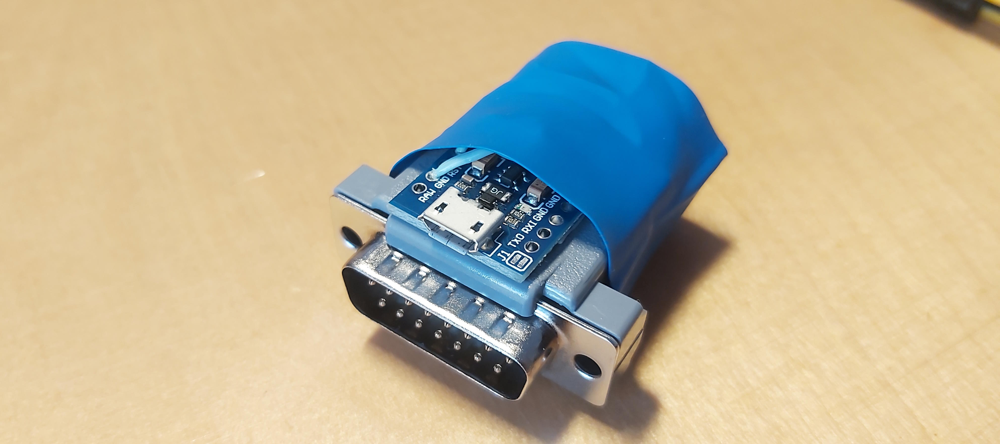
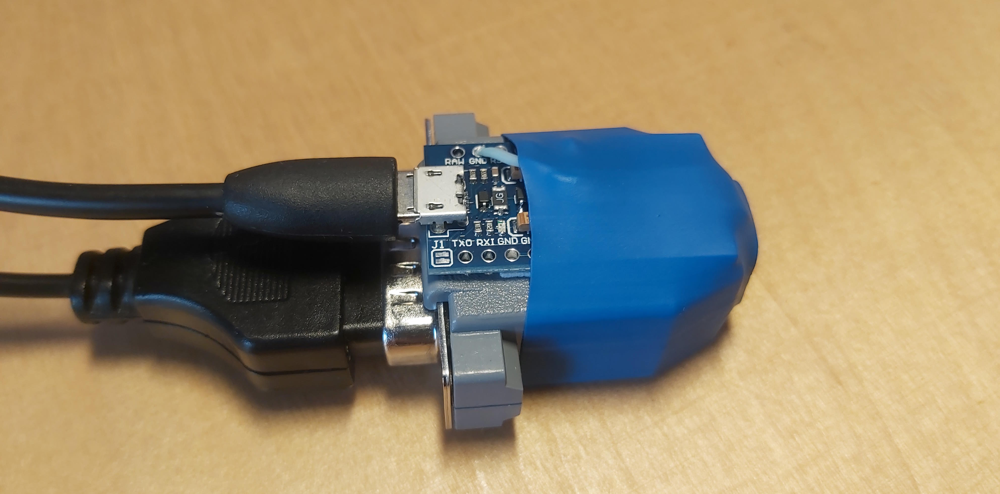

# USB adapter for NES (Dendy) gamepad

Adapter features:  
- No gamepads modification needed  
- Recognized by PC as USB keyboard or USB gamepad (working mode can be switched any time)  

Video demo:  
https://vkvideo.ru/video-228936534_456239021   
https://youtu.be/PK0Xq24e0vw  

  
  

## Repository content

[NesGamepad_keyboard](https://github.com/IvoryRubble/nes_gamepad_usb_adapter/blob/master/NesGamepad_keyboard/ButtonDebounce.h)  
Firmware for adapter that emulates only USB keyboard.
Press Start on gamepad during startup to enable serial output.    

[NesGamepad_keyboard_and_joystick](https://github.com/IvoryRubble/nes_gamepad_usb_adapter/tree/master/NesGamepad_keyboard_and_joystick)  
Firmware for adapter that emulates USB keyboard or USB gamepad.   
Press Start+A on gamepad during startup to change output mode to keyboard.  
Press Start+B on gamepad during startup to change output mode to joystick.  

## Dependencies

`NesGamepad` library to interact with gamepad:  
https://github.com/IvoryRubble/ArduinoNesGamepadLibrary  

`Joystick` library for NesGamepad_keyboard_and_joystick example:  
https://github.com/MHeironimus/ArduinoJoystickLibrary  

This `ButtonDebounce` class is also used:  
https://gist.github.com/IvoryRubble/4eb6355ca0a115232f57452e6ee2bdb1  

## Making of

  
  
  
  
  
  
